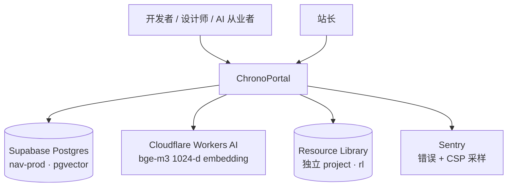
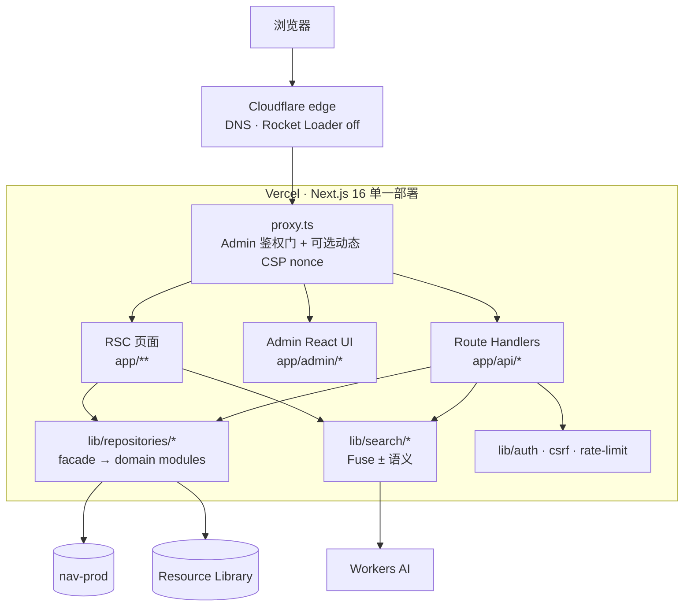
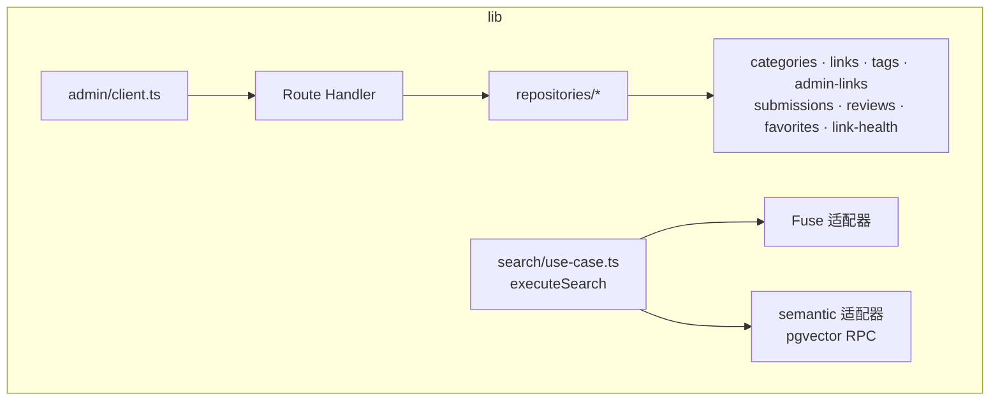

<!-- doc-template: project/ARCHITECTURE v1 -->
# ChronoPortal · 架构

> **本地：** `D:\projects\ChronoPortal` · **生产：** https://yuanjia1314.ccwu.cc
> **本文件 = 本产品系统结构权威。** 技术栈表见 [`PROJECT.md`](./PROJECT.md) —— **本文不复述栈**。
>
> **底稿：** 2026-07-22 的只读架构测绘（现归档于 [`ops/cp-architecture-asis-2026-07.md`](./ops/cp-architecture-asis-2026-07.md)）。
> 那份测绘对**现状的描述是准确的**，出错的是它引用的「目标栈 SSOT」（已废止的六仓口径）。
> 本文取其中仍然成立的部分，去掉那套目标栈声明。

---

## 0. 五问速答

| 问 | 答 |
| --- | --- |
| 这是什么系统 | 综合 AI / 开发 / 设计**资源导航站** —— 收录链接 × 分类 × 标签 × 搜索，带 Admin 审核台 |
| 谁在用 | 开发者 / 设计师 / AI 从业者（秒级扫一眼做决策）· 站长（Admin CRUD） |
| 边界在哪 | 系统内：导航浏览 + 混合搜索 + 提交/收藏/评价 + Admin。系统外：被收录的外部工具本身 |
| 怎样算跑通 | `pnpm typecheck && pnpm test` 全绿；`pnpm verify:production` 生产探针全 PASS |
| 扩展点在哪 | 新能力优先落在 `lib/repositories/*`（数据）+ `app/api/*`（薄 route）；Admin 走 `lib/admin/client.ts` |

---

## 1. C4 视图

### Level 1 · System Context



### Level 2 · Container



### Level 3 · Component



---

## 2. 模块职责与边界

| 模块 | 职责 | **不负责什么** | 代码位置 |
| --- | --- | --- | --- |
| `lib/repositories/*` | 数据访问 facade → 按域拆的 deep modules | 不写 HTTP、不碰 UI | `lib/repositories/` |
| `lib/search/*` | `executeSearch` 用例 + Fuse + 语义 + 合并 | 不直连 DB（走 repository） | `lib/search/` |
| `lib/admin/*` | Admin 契约与 client | **不直连 repository** —— 必须经 Route Handler（ADR-009） | `lib/admin/` |
| `lib/supabase/*` | 服务端客户端与配置 | — | `lib/supabase/` |
| `lib/auth.ts` · `with-admin` · `csrf` · `rate-limit*` | 鉴权与横切 | — | `lib/` |
| `lib/csp.ts` | CSP builders / flags / nonce | **不是产品主路径**，是安全加固 | `lib/csp.ts` |
| `lib/embedding-runtime.ts` · `search/embed-provider` | Embed 端点解析与调用 | 不持有密钥 | `lib/` |
| `proxy.ts` | Edge：Admin 鉴权门 + 可选动态 CSP | 不承载业务 | `proxy.ts` |
| `workers/` | CF Worker：embed 反代（**旁路**，非 Next 主进程） | — | `workers/` |

> **最关键的边界：** Admin 的 UI **不得**绕到 repository —— 必须 `UI → lib/admin/client.ts → Route Handler → repository`。
> 由 `tests/admin-boundary.test.ts` 守门。这条是 ADR-009 的落地，也是本仓最容易在「图省事」时被破坏的边界。

---

## 3. 数据流

### 读路径

```
浏览器 → Next RSC 页面 / Route Handler
       → lib/repositories/*（facade）
       → 域模块 → Supabase(nav-prod) / pgvector
       → 可选：lib/search 的语义分支 → CF Workers AI (bge-m3 1024-d)
```

搜索是**混合**的：Fuse（关键词）+ 可选语义（pgvector RPC `search_links_semantic_v2`），两路结果在 `lib/search` 合并。

### 写路径

```
Admin UI → lib/admin/client.ts → /api/admin/* Route Handler
         → proxy.ts 鉴权门（admin 角色）
         → lib/repositories/* → Supabase(nav-prod)
```

**数据源 SSOT：**

| 逻辑名 | 角色 | 备注 |
| --- | --- | --- |
| **nav-prod** | **生产业务权威**（分类/链接/标签/评价/收藏/限流表） | 主路径 |
| nav-dev | Preview / 记忆向 | **勿与 prod key 串库**（见 HANDOFF §2 的 key 串库陷阱） |
| **rl** | Resource Library（爬取/公开页） | 独立 project；公开读 + service fallback |

---

## 4. 扩展点与禁止项

**想加 X 该改哪里**

| 想加 | 改哪里 |
| --- | --- |
| 新的可收录实体 | `lib/repositories/` 新增域模块 + migration |
| 新的公开 API | `app/api/<name>/route.ts`（薄）+ `lib/**` 放用例 |
| 新的 Admin 能力 | `lib/admin/client.ts` 加契约 → `app/api/admin/*` → UI |
| 换搜索策略 | `lib/search/` 的适配器缝（ADR-004），**不动** route |
| 改 CSP | `lib/csp.ts` + `proxy.ts`；决策记录进 ADR |

**架构层面的禁止项**

- 拆微服务 —— 单 Next 部署是 ADR 奠基项
- RSC 经自身 HTTP 调 repository（应直连）
- Admin UI 绕过 client 直连 repository
- 公开路径用 service_role 读明细
- 无阈值上 Meili / ES / 虚拟列表（触发条件见 `HANDOFF.md` §4 的「明确延后」）
- 把纯 docs commit 当成必须 redeploy 的 runtime 变更

---

## 5. 下挂专档

| 文件 | 主题 | 更新触发 |
| --- | --- | --- |
| [`DATA_MODEL` 语义] `scripts/migration-*.sql` · `rls-audit.sql` | 数据模型与 RLS | 改 schema / RLS |
| [`PRODUCTION-RUNBOOK.md`](./PRODUCTION-RUNBOOK.md) | 生产运维手册 | 部署/回滚流程变化 |
| [`oncall-and-alerts.md`](./oncall-and-alerts.md) | 告警与值班 | 告警规则变化 |
| [`openapi.json`](./openapi.json)（`pnpm docs:openapi` 生成） | 对外 API 契约 | route / DTO 变化 |
| [`DESIGN-DOC.md`](./design/DESIGN-DOC.md) | 设计简报与视觉矩阵 | 设计语言变化 |
| [`DESIGN-BRIEF.md`](./design/DESIGN-BRIEF.md) | 用户画像 · 品牌人格 · 无障碍 | 定位变化 |

> `DESIGN-BRIEF.md` 原名 `PRODUCT.md`（在仓根）。内容是**设计简报**而非产品概述 ——
> 产品概述已并入 [`PROJECT.md`](./PROJECT.md) §0，故把它归入 `design/` 以免与 SSOT 争夺「产品定义」的位置。

---

## 6. 更新触发条件

出现以下情况时回来改本文件：

- 新增或删除 `lib/` 域模块、页面路由、API 路由
- 改变跨层调用方式（尤其 Admin 边界与 RSC→repository 直连）
- 引入新的外部依赖服务（新的库、新的第三方 API）
- 改动数据源 SSOT（三个 Supabase 项目的职责划分）
- 搜索策略变化（Fuse / 语义的配比或阈值）

---

## 7. 已知技术债与风险

| 项 | 影响 | 现状 | 触发条件 / 缓解 |
| --- | --- | --- | --- |
| Enforcing script 仍有 `unsafe-inline` | XSS 面收窄不完全 | 默认保留；env `CSP_SCRIPT_UNSAFE_INLINE` 可控 | 待 T9″（proxy/layout 接 nonce）；决策见 `docs/archive/csp-t9-decision-2026-07-22.md` |
| `SUPABASE_SERVICE_ROLE_KEY` 与 RL 串库 | 误写生产库 | 已文档化（HANDOFF §2） | 对 nav-prod 写库必须用 `SUPABASE_PROD_SERVICE_ROLE` |
| NTFS reparse point（本机） | Turbopack 构建失败 | 已在 scripts 固定 `--webpack` | 仅本机；换机器即消失 |
| favorites 仅应用层权限 | 越权读风险 | C1 已做应用层纵深 | 触发条件：需要 DB 级保证时上 JWT/RPC（HANDOFF §4 F） |
| 支付 API 为预留死代码 | 认知负担 | `ENABLE_PAYMENTS_API=0` 时 404 | 真要上支付时先写 spec |
